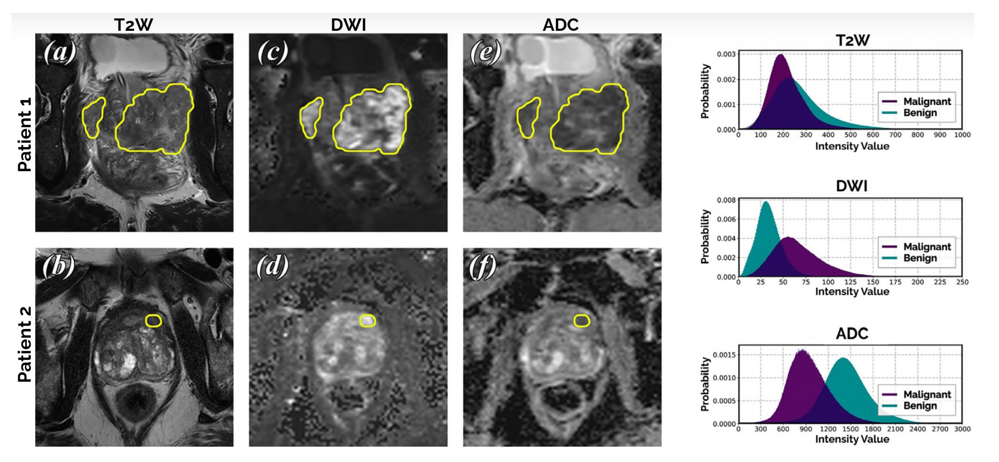
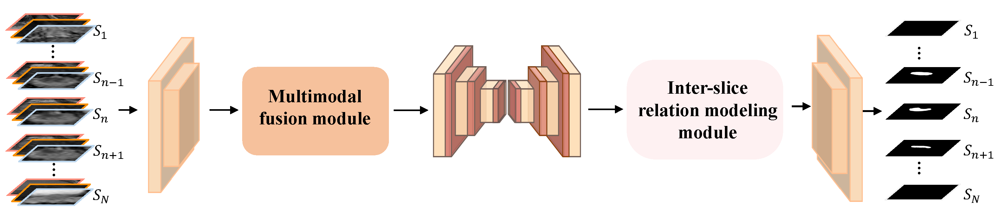

## Improved UNet for Multimodal Prostate Lesion Segmentation Across Varying Axial Resolutions
We developed an improved UNet tailored for the [**PI-CAI challenge**](https://pi-cai.grand-challenge.org), specifically designed to handle multimodal MRI data with varying axial resolutions. The framework incorporates a multimodal fusion module and an inter-slice relational modeling component. The framework integrates a **multimodal fusion** module and an **inter-slice relation modeling** module. To address the severe class imbalance—caused by limited segmentation labels and small foreground regions—we adopted strategies including **[MedSAM](https://github.com/bowang-lab/MedSAM-assisted)-assisted pseudo-label generation**, a **hybrid BCE-Dice** loss, and **foreground-aware pre-extraction**.


## Multimodal MRI-Based Prostate Lesion Segmentation



## Overview of Our Framework



# Setup
In order to run our model, we suggest you create a virtual environment 
```
conda create -n picai
``` 
and activate it with 
```
conda activate picai
```
Subsequently, download and install the required libraries by running 
```
pip install -r requirements.txt
```

# Data Preprocessing
**1. Aligning multimodal MRI** (`./dataset_process/registration.py`). The three MRI modalities (T2W, DWI, and ADC) for each case are not acquired simultaneously, so they are not spatially aligned. To address this, we perform **affine registration** to align DWI images, ADC images, and segmentation labels to the space of the T2W images.

**2. Generating segmentation labels using MedSAM**  (`./dataset_process/mask_refine.py`). In the PI-CAI challenge, only a small subset of the data includes manual annotations. To leverage the large amount of unlabeled data, we first perform coarse lesion segmentation using a [pretrained tool](https://github.com/DIAGNijmegen/Report-Guided-Annotation). The coarse segmentation results are then used as bounding box prompts for [**MedSAM**](https://github.com/bowang-lab/MedSAM), which refines and generates improved segmentation masks.

**3. Foreground region pre-extraction** (`./dataset_process/image_crop.py`)  According to clinical prior knowledge, prostate lesions are typically located within or around the prostate gland. Therefore, we narrow the foreground region using coarse prostate segmentation results generated by a [pretrained tool](https://github.com/DIAGNijmegen/Report-Guided-Annotation).  
Specifically, we extract a foreground image patch from the original image using a 256×256 box centered on the coarse prostate mask.

**4. Making Dataset** (`./dataset_process/make_dataset.py`).  We randomly split the dataset into training and testing sets with a 4:1 ratio.  The final dataset structure is organized as follows, where each case contains four NIfTI files:

```
dataset/
├── train/
│ ├── case1/
│ │ ├── t2w.nii.gz
│ │ ├── dwi.nii.gz
│ │ ├── adc.nii.gz
│ │ └── lesion.nii.gz
│ ├── case2/
│ │ ├── ...
│ │ └── ...
│ └── ...
├── test/
│ ├── case1/
│ │ ├── t2w.nii.gz
│ │ ├── dwi.nii.gz
│ │ ├── adc.nii.gz
│ │ └── lesion.nii.gz
│ ├── case2/
│ │ ├── ...
│ │ └── ...
│ └── ...
```

# Model Training and Testing
We recommend creating and activating a virtual environment before running the training and testing scripts.
To train the model, run:
```
python train.py
``` 
To test the model after training, run:
```
python test.py
```


# Acknowledgement
This project is developed with reference to the following repositories:

(1) https://pi-cai.grand-challenge.org

(2) https://github.com/DIAGNijmegen/Report-Guided-Annotation

(3) https://github.com/bowang-lab/MedSAM-assisted

(4) https://github.com/McGregorWwww/UCTransNet
